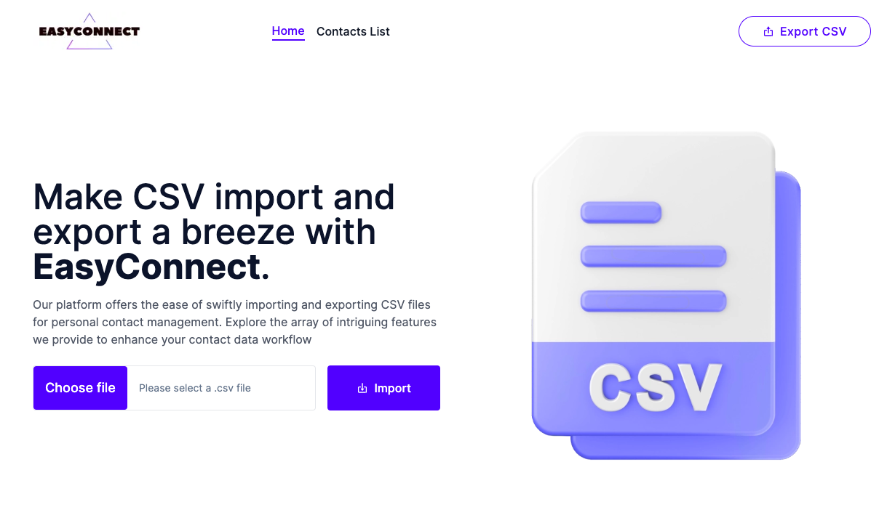
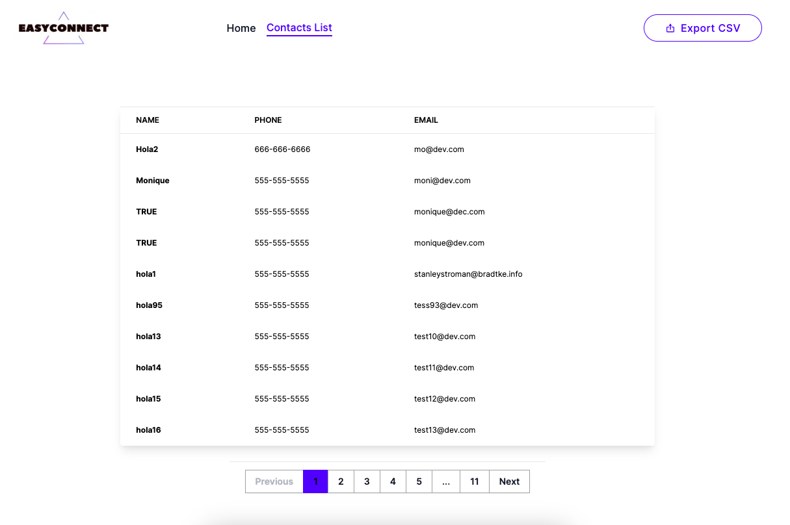

# EasyConnect - Simplifying CSV Import and Export





## Description

EasyConnect is a platform designed to streamline the process of importing and exporting CSV files, especially useful for personal contact management. Our tool offers an array of intriguing features that will significantly enhance your contact data workflow.

## Key Features

- Quickly and easily import CSV files.
- Efficiently export your contact data to CSV files.
- Intuitively manage and organize your contacts.
- Perform advanced searching and filtering to find the information you need.
- Customize contact fields and attributes to suit your needs.
- Maintain a history of changes for precise tracking.
- Compatible with multiple CSV formats and operating systems.
- And much more!

## Installation

To get started with EasyConnect, follow these steps:

1. Clone the repository from GitHub:

   ```bash
   git clone https://github.com/TiffMonique/challenge-csv.git
   ```

2. Navigate to the project directory:
   ```bash
   cd challenge-csv
   ```
   
3. Install the required dependencies
    ```bash
    npm i
   ```
    
5. Start the EasyConnect application

    ```bash
    npm run dev
    ```

